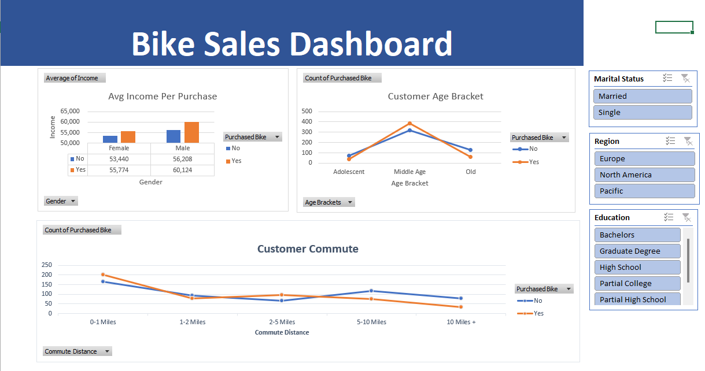

# Bike Sales Dashboard

## Project Overview

This project is an interactive Bike Sales Dashboard built in Microsoft Excel. The goal was to analyze customer demographics and purchasing behavior and present the findings in a clear, interactive dashboard.

This was a guided portfolio project based on a tutorial by Alex The Analyst. I worked through the project to strengthen my practical skills in data cleaning, PivotTables, data analysis, and dashboard creation.

## Objectives

- Analyze customer bike purchasing behavior
- Explore purchasing patterns across different customer demographics
- Compare average income between customers who purchased a bike and those who did not
- Analyze bike purchases across different age brackets
- Examine purchasing behavior by commute distance
- Build an interactive Excel dashboard using PivotTables, charts, and filters

## Tools Used

- Microsoft Excel
- PivotTables
- PivotCharts
- Slicers
- Data cleaning and preparation

## Dataset

The dataset contains 1,000 customer records with information including:

- Gender
- Marital status
- Income
- Number of children
- Education
- Occupation
- Home ownership
- Number of cars
- Commute distance
- Region
- Age
- Bike purchase status

## Dashboard

The dashboard provides an interactive view of bike purchasing behavior through charts and filters for:

- Marital Status
- Region
- Education

The main visualizations include average income per purchase, customer age brackets, and customer commute distance.

## Key Insights

- The dataset contains 1,000 customers, of whom 481 purchased a bike and 519 did not.
- Customers in the middle-age bracket recorded the highest number of bike purchases in the dataset.
- Customers with a commute distance of 0–1 miles recorded the highest number of bike purchases among the commute-distance categories.
- Customers who purchased bikes had higher average income than customers who did not purchase bikes for both male and female customers.
- North America recorded the highest number of bike purchases among the three regions shown in the analysis.

These findings describe patterns in the dataset and do not imply that any individual factor caused a customer to purchase a bike.

## Key Skills Practiced

- Data cleaning and preparation
- PivotTables
- PivotCharts
- Data analysis
- Data visualization
- Dashboard design
- Extracting insights from customer data

## Project Credit

This project was completed as a guided learning project based on Alex The Analyst's Bike Sales Excel tutorial. The purpose of recreating the project was to gain hands-on experience with Excel data analysis and dashboard creation.
