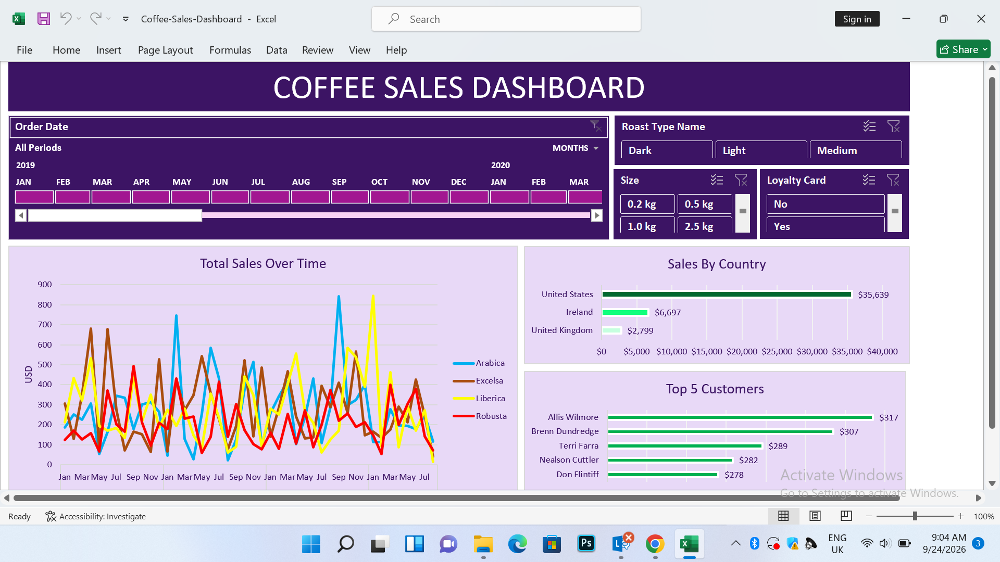

# Coffee Sales Dashboard

## Project Overview

This project is an interactive Coffee Sales Dashboard built in Microsoft Excel. The goal was to analyze coffee sales data and turn the raw data into a clear dashboard that makes it easier to understand sales performance, customer purchasing behavior, and product trends.

This was a guided portfolio project based on a tutorial by Mo Chen. I worked through the project to strengthen my practical skills in data cleaning, analysis, Excel formulas, PivotTables, PivotCharts, and dashboard creation.

## Objectives

- Analyze coffee sales performance over time
- Identify sales trends and patterns
- Understand sales performance across different countries
- Identify top customers
- Analyze product and coffee-type performance
- Create an interactive dashboard for exploring the data

## Tools Used

- Microsoft Excel
- Excel formulas
- PivotTables
- PivotCharts
- Slicers
- Timeline filters

## Data Preparation

The dataset contained information across Orders, Customers, and Products. I worked with the data to prepare it for analysis and connect the different pieces of information needed for the dashboard.

## Dashboard

The final dashboard brings the analysis together into an interactive view, allowing users to explore sales performance using filters and visualizations.

## Key Insights

- Total sales across the dataset were $45,134.26, covering orders from January 2019 to August 2022.
- The United States was the largest market, generating $35,638.89, or approximately 79% of total sales.
- Excelsa recorded the highest sales among the four coffee types at $12,306.44, followed by Liberica and Arabica.
- Light roast generated the highest sales among the three roast types, contributing $17,354.47.
- The 2.5 kg coffee size generated $23,785.57, accounting for approximately 52.7% of total sales.
- Customers without a loyalty card generated $24,216.41 in sales, compared with $20,917.85 from loyalty-card customers.
- The top five customers generated a combined $1,472.91 in sales, representing approximately 3.3% of total sales.

## Key Skills Practiced

- Data cleaning and preparation
- Data organization
- Excel formulas
- PivotTables and PivotCharts
- Data visualization
- Dashboard design
- Extracting business insights from data

## Project Credit

This project was completed as a guided learning project based on Mo Chen's Coffee Sales Dashboard tutorial. The purpose of recreating the project was to gain hands-on experience with Excel and strengthen my data analytics skills.
