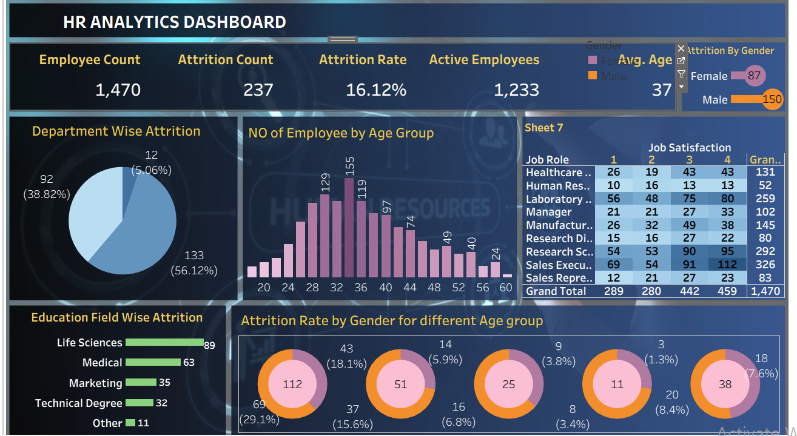

# HR Analytics Dashboard

## Project Overview

This project is an interactive HR Analytics Dashboard built in Tableau. The dashboard analyzes employee attrition and workforce patterns across areas such as department, gender, age, education, and job-related factors.

This was a guided portfolio project based on a Tableau tutorial. I worked through the project to strengthen my practical skills in Tableau, data preparation, calculated fields, data visualization, and interactive dashboard design.

## Objectives

- Analyze employee attrition patterns
- Explore attrition across different employee demographics
- Compare attrition across departments and education fields
- Examine attrition by gender and age
- Analyze employee job satisfaction
- Build an interactive HR dashboard in Tableau
- Practice presenting HR data through clear visualizations

## Tools Used

- Tableau
- Microsoft Excel
- Tableau calculated fields
- Data visualization
- Interactive dashboard design

## Dataset

The dataset contains employee information used to analyze workforce characteristics and attrition patterns.

Some of the fields included in the dataset are:

- Employee Number
- Age
- Gender
- Department
- Education
- Education Field
- Job Role
- Job Satisfaction
- Attrition
- Monthly Income
- Years at Company
- Years in Current Role
- Years Since Last Promotion

## Dashboard

The dashboard brings together multiple visualizations to provide an overview of employee attrition and workforce patterns.

The analysis includes views covering:

- Employee count
- Attrition
- Attrition rate
- Attrition by gender
- Attrition by education field
- Employee age distribution
- Employee education
- Job satisfaction
- Other employee-related metrics

## Key Skills Practiced

- Data preparation
- Tableau calculated fields
- Data analysis
- Data visualization
- Dashboard design
- Interactive filters
- Presenting HR data through visualizations
- Extracting insights from employee data

## Project Outcome

This project gave me hands-on practice building an HR analytics dashboard in Tableau, from working with employee data to creating calculated fields, visualizations, and an interactive dashboard.

## Project Credit

This project was completed as a guided learning project based on a Tableau HR Dashboard tutorial. The purpose of recreating the project was to gain practical experience with Tableau and strengthen my data analytics and dashboard development skills.

### Tutorial References

[Part 1: Tableau Dashboard from Start to End | HR Dashboard | Beginner to Pro](https://youtu.be/oAIubTqg-Kw?si=O_hP795AR8s32Qmu)

[Part 2: Tableau Dashboard from Start to End | HR Dashboard | Beginner to Pro](https://youtu.be/oTyCZVnNVZA?si=UfIRUoDw7ISlpH5W)
