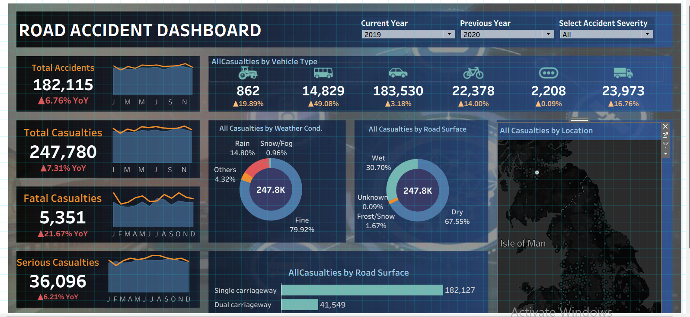

## Road Accident Dashboard

## Project Overview

This project is an interactive Road Accident Dashboard built using Tableau. The dashboard analyzes road accident data and presents key metrics and patterns relating to accidents, casualties, severity, vehicle types, road conditions, weather, and location.

This was a guided portfolio project based on a two-part Tableau tutorial. I worked through the project to strengthen my practical skills in Tableau, data preparation, calculations, data visualization, and interactive dashboard design.

## Objectives

* Analyze total road accidents and casualties
* Compare accident and casualty figures across different years
* Analyze casualties by accident severity
* Examine casualties by vehicle type
* Analyze casualties across different road types
* Explore casualties by road surface conditions
* Examine casualties under different weather conditions
* Analyze the geographical distribution of casualties
* Build an interactive dashboard that makes accident patterns easier to explore

## Tools Used

* Tableau
* Tableau calculations
* Parameters
* Data visualization
* Interactive dashboard design

## Dataset

The dataset contains road accident information including:

* Accident severity
* Accident date
* Number of casualties
* Number of vehicles
* Vehicle type
* Road type
* Road surface conditions
* Weather conditions
* Urban or rural area
* Location information

## Dashboard Features

The dashboard includes:

* Total Accidents KPI
* Total Casualties KPI
* Fatal, Serious, and Slight Casualties
* Year-over-Year comparisons
* Casualty trend sparklines
* Casualties by vehicle type
* Casualties by road type
* Casualties by road surface
* Casualties by weather condition
* Location-based accident analysis
* Interactive year parameters
* Accident severity selection

## Key Skills Practiced

* Data preparation
* Tableau calculations
* Parameter creation
* KPI development
* Data visualization
* Interactive dashboard design
* Geographic analysis
* Analytical storytelling

## Dashboard

The Tableau packaged workbook is included in this repository as:

ROAD ACCIDENT DASHBOARD.twbx

The workbook can be downloaded and opened in Tableau to explore the interactive dashboard.

## Project Outcome

Working through this project helped me strengthen my ability to transform raw accident data into an interactive Tableau dashboard and communicate patterns through visualizations.

## Project Credit

This project was completed as a guided learning project based on the following Tableau tutorial:

Part 1: Tableau Dashboard from Start to End (Part 1) | Road Accident Dashboard | Beginner to Pro

Part 2: Tableau Dashboard from Start to End (Part 2) | Road Accident Dashboard | Beginner to Pro

The purpose of recreating the project was to gain hands-on experience with Tableau and strengthen my data analytics and visualization skills.
